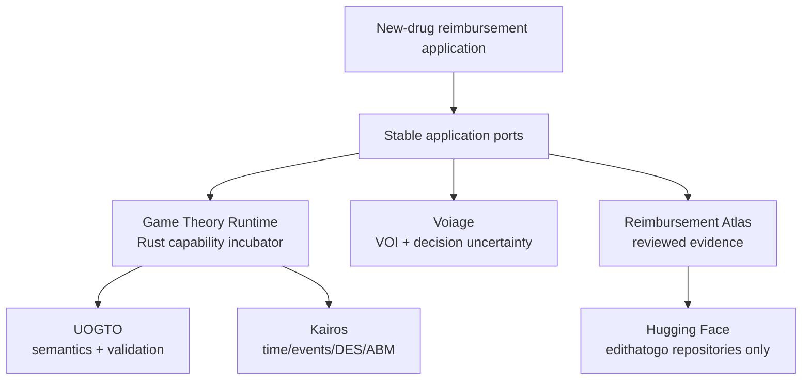

# New Drug Reimbursement Game

An ecosystem-first, clean-room research-software implementation inspired by
Brita A. K. Pekarsky's *The New Drug Reimbursement Game* (Springer, 2015).

This repository has two deliberately separate concerns:

1. **Application:** price-effectiveness analysis and the new-drug reimbursement
   games described by Pekarsky, extended for uncertainty, evidence governance,
   repeated interaction, contracts, equity, and empirical calibration.
2. **Capability incubator:** a domain-neutral game-theory runtime intended to
   become a Rust library above **Kairos**, with semantics supplied by **UOGTO**.

The repository does **not** contain the book, copied figures, copied tables, or
substantial source text. It implements equations and concepts independently and
cites the source.

## Ecosystem-first rule

When a capability already exists, or is being developed, in the `edithatogo`
ecosystem, that capability is authoritative:

| Concern | Authoritative component | This repository's role |
|---|---|---|
| Game-theory semantics | [`edithatogo/UOGTO`](https://github.com/edithatogo/UOGTO) | Application extension and executable conformance fixtures |
| Simulation, time, events, ECS, DES/ABM | [`edithatogo/kairos`](https://github.com/edithatogo/kairos) | Adapter contract only; no second scheduler |
| Value of information | [`edithatogo/voiage`](https://github.com/edithatogo/voiage) | Convert reimbursement outcomes to Voiage inputs |
| Reimbursement evidence | [`edithatogo/reimbursement-atlas`](https://github.com/edithatogo/reimbursement-atlas) | Consume reviewed derived records; no parallel data lake |
| Hugging Face assets | [`edithatogo/*`](https://huggingface.co/edithatogo) only | Manifests and derived configs; no third-party Hub dependency |
| General game runtime | Rust capability incubated here, then extracted | Reference implementation and domain-neutral conformance suite |

No runtime dependency on Nashpy, Gambit/pygambit, OpenSpiel, BCEA, heemod, or
dampack is permitted. Generic implementation libraries may be used only through
an explicit dependency decision and migration ledger.

## Architecture



The application never imports a solver implementation directly. It depends on
ports. The current pure-Python solver is a small conformance oracle, not a new
public game-theory library. The Rust crates under `crates/` are the extraction
seed for the general capability.

## Implemented now

- Price-effectiveness analysis (PEA) primitives: IPER, reimbursement health
  effect, net economic benefit in health units, economic value of clinical
  innovation, and the health shadow price.
- Strict, source-mapped evaluators for all four Chapter 7 economic scenarios,
  including the Appendix 5 investment formulation for `mu`, alongside a
  separately labelled generalized opportunity-set API.
- Analytic Chapter-8-style revealed-threshold equilibrium under explicit
  assumptions.
- A domain-neutral finite perfect-information game model and backward-induction
  solver in Rust, plus a small Python conformance oracle.
- UOGTO-aligned RDF/JSON-LD application extension and SHACL proposal.
- Ports/adapters for Voiage, Kairos, UOGTO, and local exports from Reimbursement
  Atlas.
- A strict approved-derived parameter-evidence packet, deterministic Chapter 7
  calibration receipts, and aligned Voiage `ValueArray`/`ParameterSet` handoff.
- A fail-closed NHS England methodological candidate dossier and deterministic
  readiness receipt covering every Chapter 7 scenario without promoting public
  estimates into approved calibration evidence.
- An `edithatogo`-only Hugging Face manifest.
- Research synthesis and a post-2015 extension map.
- Upstream proposal packets for UOGTO, Kairos, Voiage, and Reimbursement Atlas.
- A comprehensive Codex implementation prompt.

## Bundle-first Codex handoff

The v0.4.0 handoff is designed to be copied into an otherwise empty parent
folder. Its outer covering prompt restores this repository from a Git bundle,
which preserves the original history and tags. Codex then executes
`CODEX_REPOSITORY_ACTIVATION_PROMPT.md` inside the checkout to create or safely
wire the GitHub remote, resolve the pinned owner-controlled ecosystem clones,
activate Conductor, and continue autonomously into
`CODEX_IMPLEMENTATION_PROMPT.md`.

The source ZIP is supplied as an auditable fallback tree, but the Git bundle is
the authoritative restoration path. See `START_HERE_CODEX.md` and
`docs/GITHUB_BOOTSTRAP.md`.

## Quick start

```bash
python -m reimbursement_game.cli evaluate examples/cases/chapter8_example.json
python -m reimbursement_game.cli scenario examples/cases/chapter7_scenario4.json
python -m reimbursement_game.cli evidence fixtures/evidence/synthetic-chapter7-parameter-packet-v1.json
python -m reimbursement_game.cli pilot-readiness fixtures/evidence/nhs-england-methodological-candidates-v1.json
python -m reimbursement_game.cli calibrate fixtures/evidence/synthetic-chapter7-parameter-packet-v1.json scenario_3 120 20 --case-id synthetic-demo --record n=n-allocative --record m=m-contraction --record d=d-displacement
python -m reimbursement_game.cli equilibrium examples/cases/chapter8_example.json
python -m reimbursement_game.cli uogto examples/cases/chapter8_example.json
python scripts/validate_scope.py
```

For Rust:

```bash
cargo test --workspace
cargo run -p new-drug-reimbursement-game
```

## Source and citation

Primary conceptual source:

> Pekarsky, B. A. K. (2015). *The New Drug Reimbursement Game: A
> Regulator's Guide to Playing and Winning*. Springer.
> https://doi.org/10.1007/978-3-319-08903-4

See `docs/research/pekar​sky-foundation.md`, `REFERENCES.md`, and
`CITATION.cff`. The soft hyphen-like character in the path above is avoided in
actual filenames; the file is `docs/research/pekarsky-foundation.md`.

## Status

This is research software and a capability incubator. It is not a reimbursement
recommendation, an HTA submission, or regulator-grade software. See
`IMPLEMENTATION_STATUS.md` and `docs/governance/model-risk.md`.

The committed evidence fixture is synthetic and explicitly prohibited from
decision use. Real calibration requires approved Atlas-derived records and
independent health-economic review; see
`docs/architecture/evidence-calibration-contract.md`.
The NHS England pilot remains candidate-only; see
`docs/research/nhs-england-methodological-pilot.md`.
