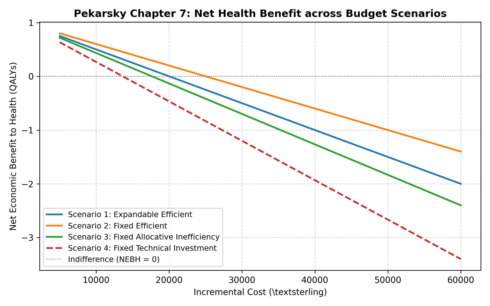
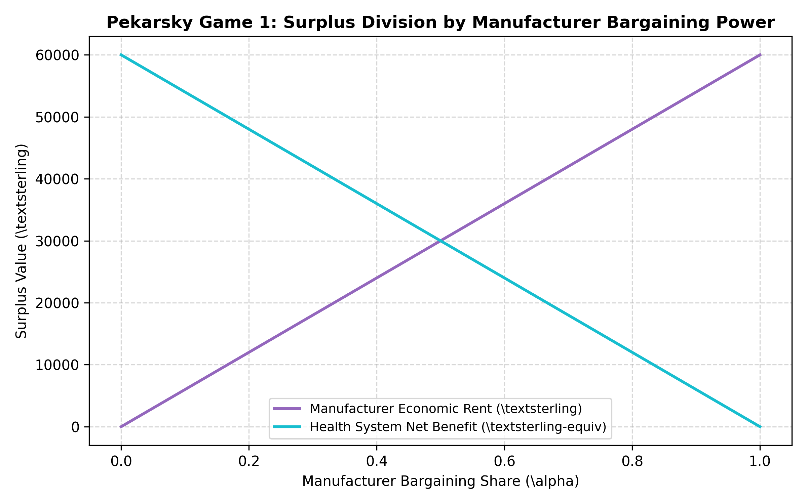
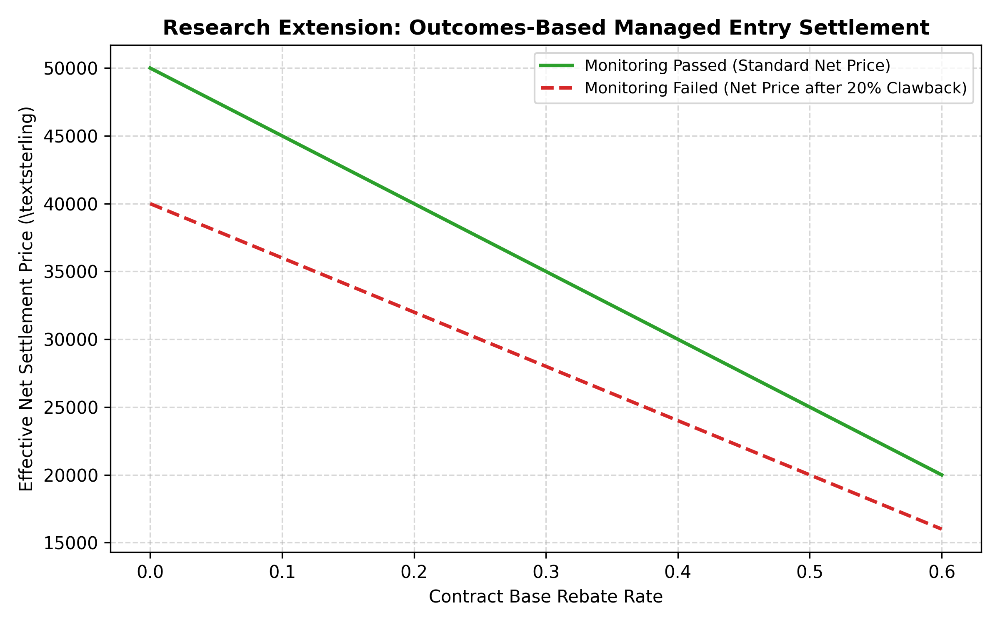

# Scenario Sweeps and Game Equilibria

This document outlines the theoretical foundations, parameter domains, and empirical interpretations of the scenario sweep and strategic bargaining models in the `new-drug-reimbursement-game` platform.

---

## 1. Chapter 7 Economic Scenarios

Pekarsky (2015, Chapter 7) formalizes four distinct institutional scenarios governing the Net Economic Benefit to Health (NEBH) of reimbursing a new clinical innovation with incremental cost $\Delta c$ and incremental health effect $\Delta h$:

| Scenario | Description | Efficiency Condition | Shadow Price ($\beta$) |
|---|---|---|---|
| **Scenario 1** | Expandable budget with efficient reallocation | $n > 0$ | $\beta = n$ |
| **Scenario 2** | Fixed budget with efficient reallocation | $n = m$ | $\beta = d$ |
| **Scenario 3** | Fixed budget with allocative inefficiency | $m > n, n \le d \le m$ | $\beta = \frac{1}{\frac{1}{d} + \frac{1}{n}(1 - \frac{n}{m})}$ |
| **Scenario 4** | Fixed budget with technical investment | $\mu < m, \phi > 1, d \le m$ | $\beta = \frac{1}{\frac{1}{d} + \frac{1}{\mu}(1 - \frac{\mu}{m})}$ |

### Figure 1: Net Health Benefit Frontiers
Below is the comparative Net Economic Benefit to Health (NEBH) across Scenarios 1–4 as incremental cost increases:



---

## 2. Chapter 8 Strategic Pricing Equilibria

In Pekarsky (2015, Chapter 8, Game 1), a single pharmaceutical innovator selects an Incremental Price-Effectiveness Ratio (IPER) $p$, and a budget-constrained healthcare institution decides whether to reimburse:

$$\max_{p} \pi_{\text{firm}} = (p - \text{IMER}) \cdot \Delta h \quad \text{subject to} \quad \text{NEBH}(p) \ge 0$$

When the firm holds bargaining share $\alpha \in [0, 1]$:
- Offered Price: $p^*(\alpha) = \alpha \cdot \beta$
- Firm Economic Rent: $\pi_{\text{firm}} = \alpha \cdot \beta \cdot \Delta h$
- Health System Net Benefit: $\text{NEBH}_{\text{inst}} = (1 - \alpha) \cdot \beta \cdot \Delta h$

### Figure 2: Strategic Bargaining Surplus Division
The division of total surplus between innovator profits and healthcare system health gains is illustrated below:



---

## 3. Outcomes-Based Managed Entry Agreements

Under managed access agreements with conditional monitoring and clawback provisions:
- **Net Price (Monitoring Passed)**: $p_{\text{net}} = p_{\text{list}} \cdot (1 - r_{\text{rebate}})$
- **Net Price (Monitoring Failed with Clawback $c_r$)**: $p_{\text{effective}} = p_{\text{list}} \cdot (1 - r_{\text{rebate}}) \cdot (1 - c_r)$

### Figure 3: Managed Entry Settlement
The effective net settlement price across contract rebate tiers with and without performance penalties:



---

## 4. Reproducing Figures via CLI

To regenerate all scenario sweep figures deterministically:

```bash
ndr-game sweep --output-dir docs/figures
```
